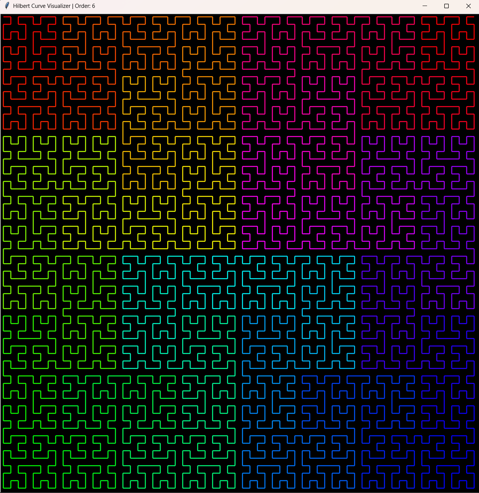

# Hilbert Curve Generator

A dynamic Hilbert Curve visualizer that generates a space-filling fractal by mapping one-dimensional data into two-dimensional space.



## Usage
```python hilbert_curve.py <order>```

Example: ```python hilbert_curve.py 6```

If no order is provided, default order used is 5.